# アプリケーション名
認知行動療法実践アプリ

# アプリケーション概要
認知行動療法の手法のひとつである「トリプルカラム法」を手軽に実践するアプリ 

【参考】トリプルカラム法 
起きた出来事に対して、 
①自動思考（出来事に対する直感的で無意識の思考や感情） 
②認知のゆがみ（自動思考が陥りがちな10のパターン） 
③合理的な反応（客観的で冷静な見方や合理的な考え方を取り入れた、より建設的で健康な反応） 
を整理して視覚的に表現する方法。 
ユーザーは日々の出来事に対してこのフレームワークを適用し、ネガティブな思考や感情に気付き、 
それに対してより建設的で健康な反応を見つけるトレーニングを行います。 
それにより、ポジティブな変化やストレスの変化が期待されます。

# URL
https://cbt-app.onrender.com

# テスト用アカウント
・Basic認証ID：admin 
・Basic認証パスワード：0413 
・メールアドレス：test5@test.com 
・パスワード：test555

# 利用方法

## トリプルカラム法のワークをする
1. トップページ（投稿ワーク一覧ページ）のヘッダーからユーザー新規登録/ログインをする
2. 「ワークを開始する」ボタンから、3つの指示文にしたがって入力をする

# アプリケーションを作成した背景
このアプリケーションは、メンタルヘルス悪化予防の観点から制作しました。 
近年、日本ではビジネスパーソンのメンタルヘルス不調が増加しており、これに対するケアの必要性が高まっています。 
行政や企業がメンタルヘルスケアを強化している一方で、予防の観点からは個人の改善が不可欠です。 
その中で、科学的に根拠がある「認知行動療法」が個人のメンタルヘルスの向上に有効であることが知られています。 
しかし、現状オンラインで利用できるサービスは有料のものが多く、 
手軽に実践できる場が限られていることが課題であると考えました。 
そこで、このアプリを制作し、認知行動療法を気軽に実践できる場を提供することにしました。

# 実装した機能について

## トップページ（一覧ページ）

・ログアウトしている時には、過去に投稿したワークおよびワーク新規投稿ページに遷移するボタンが表示されません 
・ヘッダーに、ユーザー新規登録ページに遷移するボタンとログインページに遷移するボタンが表示されます 

・ログインをすると、ワーク新規投稿ページに遷移するボタンとユーザーが過去に投稿したワークが表示されます 
・また、レコードに右端にある「詳細を見る」をクリックすると、選択したワークの詳細ページに遷移します 

## ワーク新規投稿ページ

・記入を促すための説明文を入れています 

 ・各選択肢の説明分を追加することで、認知行動療法になじみのないユーザーでも利用しやすいようにしています 

 ・ユーザーが参考にできるように、placeholderに記入例を記載しています 

## ワーク詳細ページ

・編集ページに遷移するボタンと削除ボタンの色を分けることで、ユーザーが間違わないようにしています 

## 編集ページ

 ・新規投稿ページとほぼ同じですが、説明文を削除することでよりシンプルにしています 

# 実装予定の機能

## 投稿一覧ページ関連
・表示したいワークを投稿日時で絞り込める機能 
・ワークを日付ごとにまとめて表示する機能 

## 詳細ページ関連
・削除ボタンをクリックした際にアラートを表示する機能

## エラーメッセージ関連
・エラーメッセージが日本語で表示されるように修正

## ユーザー関連
・ワークを継続して実行した日数を表示する機能

# データベース設計

## users テーブル

| Column             | Type   | Options                   |
| ------------------ | ------ | ------------------------- |
| nickname           | string | null: false               |
| email              | string | null: false, unique: true |
| encrypted_password | string | null: false               |

### Association

- has_many :works

## works テーブル

| Column                   | Type       | Options                        |
| ------------------------ | ---------- | ------------------------------ |
| user                     | references | null: false, foreign_key: true |
| automatic_thought        | text       | null: false                    |
| cognitive_distortion_id  | integer    | null: false                    |
| rational_thought         | text       | null: false                    |

### Association

- belongs_to :user

# 画面遷移図

# 開発環境
・フロントエンド：HTML, CSS 
・バックエンド：Ruby 
・フレームワーク: Ruby on Rails（v7.0.8） 
・データベース（開発環境）：MySQL（v14.14） 
・データベース（本番環境）：PostgreSQL（v14.10） 
・バージョン管理：Git（v2.34.1） 
・パッケージ管理：Bundler 

# ローカルでの動作方法
セットアップ手順: 
1. リポジトリをクローンします（git clone https://github.com/Kinoken0413/cbt-app.git）
2. 必要なGemをインストールします（bundle install）
3. データベースを作成します（rails db:create）
4. マイグレーションを実行します（rails db:migrate）
5. サーバーを起動します（rails server）

# 工夫したポイント

## ユーザビリティの向上
・ユーザーの記入を促す指示文を作成しました 
・認知行動療法になじみのないユーザーのために、説明文を適宜追加しました 

## プライバシーへの配慮
・パーソナルな内容を扱うため、ログインしているユーザー自身の投稿内容のみを表示する仕様にしました 

## ActiveHashの利用
・ワーク内の選択肢をActiveHashを用いて実装することで、コードの可読性を上げました 

# 改善点
・ユーザーをモチベートし、継続的にワークを実行していくための仕組みづくりが必要です 
・ワークの削除時のアラート表示や、指定した投稿日時のワークの表示など、ユーザビリティに改善余地があります 

# 制作期間
3週間
